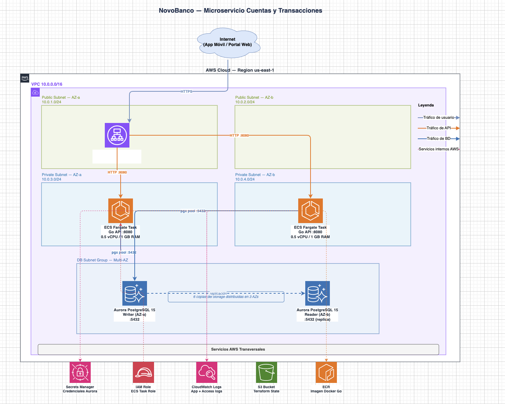

# NovoBanco — Microservicio de Cuentas y Transacciones

Microservicio REST para la gestión de cuentas bancarias y transacciones financieras de NovoBanco.
Construido en Go, contenerizado con Docker y desplegado en AWS (ECS Fargate + Aurora PostgreSQL).

---

## Descripción del Problema

El área de Canales Digitales de NovoBanco requiere un microservicio que sea consumido por la
app móvil y el portal web del banco. El sistema debe gestionar el ciclo de vida completo de
cuentas bancarias y permitir operar sobre fondos (depósitos, retiros y transferencias),
garantizando consistencia, trazabilidad y correctitud en cada operación financiera.

---

## Stack Tecnológico

| Capa | Tecnología |
|---|---|
| Lenguaje | Go 1.22 |
| Framework HTTP | Chi v5 |
| Base de Datos | Aurora PostgreSQL 15 |
| Driver BD | pgx/v5 |
| Cómputo AWS | ECS Fargate |
| IaC | Terraform |
| Contenedor | Docker (multi-stage, ~15MB) |

---

## Arquitectura AWS propuesta



---

## Cómo Levantar Localmente

### Prerequisitos

- Docker y Docker Compose instalados
- Go 1.22 (solo para desarrollo/tests)

### Levantar la aplicación

```bash
docker compose up --build
```

La API quedará disponible en `http://localhost:8080`.

La base de datos PostgreSQL se inicializa automáticamente con las migraciones al arrancar.

### Variables de entorno

| Variable | Descripción | Default local |
|---|---|---|
| `PORT` | Puerto HTTP del servidor | `8080` |
| `DATABASE_URL` | DSN de conexión a PostgreSQL | `postgres://novobanco:novobanco@db:5432/novobanco` |
| `ENV` | Entorno de ejecución (`local`, `production`) | `local` |
| `AWS_REGION` | Región AWS (solo en producción) | — |
| `SECRET_ARN` | ARN del secreto en Secrets Manager (solo en producción) | — |

En producción `DATABASE_URL` no se usa; las credenciales se obtienen de AWS Secrets Manager
mediante el IAM Role asignado a la ECS Task.

---

## Cómo Correr los Tests

```bash
go test ./... -race -count=1
```

Los tests unitarios de la capa de servicio no requieren base de datos (usan mocks de los repositorios).

---

## Endpoints de la API

| Método | Ruta | Descripción |
|---|---|---|
| `POST` | `/customers` | Crear cliente |
| `GET` | `/customers/{id}` | Obtener cliente |
| `POST` | `/customers/{id}/accounts` | Crear cuenta bancaria |
| `GET` | `/accounts/{id}` | Consultar saldo y estado |
| `PATCH` | `/accounts/{id}/status` | Bloquear o cerrar cuenta |
| `GET` | `/accounts/{id}/transactions` | Historial paginado de movimientos |
| `POST` | `/accounts/{id}/deposit` | Depositar fondos |
| `POST` | `/accounts/{id}/withdrawal` | Retirar fondos |
| `POST` | `/transfers` | Transferencia entre cuentas |
| `GET` | `/transactions/{reference}` | Buscar transacción por referencia única |

Ver ejemplos completos de request/response en [`api.http`](api.http).

---

## Decisiones Técnicas

Resumen:

| ADR | Decisión |
|---|---|
| ADR-001 | ECS Fargate sobre Lambda — pool de conexiones persistente, sin cold start |
| ADR-002 | Aurora PostgreSQL sobre DynamoDB — ACID, `SELECT FOR UPDATE`, failover < 30s |
| ADR-003 | Concurrencia resuelta en la BD con `UPDATE ... WHERE balance >= amount` |
| ADR-004 | Secretos con Secrets Manager + IAM Role, nunca en código |
| ADR-005 | Transferencia atómica en una única transacción de base de datos |
| ADR-006 | Orden de INSERT en transferencias para resolver FK self-referencial |

---

## Escenarios de Negocio

### Saldo negativo
Prevenido en dos capas: la query de retiro usa `WHERE balance >= amount` (si retorna 0 filas
→ `422 insufficient_funds`) y existe un `CHECK (balance >= 0)` en la base de datos como
última línea de defensa. Ver ADR-003.

### Cuenta inactiva
Las operaciones sobre cuentas bloqueadas retornan `422 account_blocked` y sobre cuentas
cerradas retornan `422 account_closed`. Ambos son errores distintos entre sí y distintos
del error genérico `500`.

### Transferencia parcial
Débito y crédito ocurren dentro de una única transacción de base de datos. Si el contenedor
es destruido entre ambas operaciones, PostgreSQL hace rollback automático al detectar la
conexión cerrada. Ver ADR-005.

### Concurrencia básica
`UPDATE accounts SET balance = balance - $1 WHERE id = $2 AND balance >= $1` es atómico a
nivel de fila en PostgreSQL. No existe ventana de tiempo entre la lectura y la escritura
del saldo (no hay TOCTOU). Ver ADR-003.

### Idempotencia
El campo `reference` en la tabla `transactions` tiene constraint `UNIQUE`. Si el mismo
request llega dos veces, el segundo INSERT falla con código PostgreSQL `23505` y la API
retorna `409 duplicate_reference` con la transacción existente. El cliente debe generar
y enviar una referencia única por request (idempotency key).

### Gestión de secretos
Las credenciales de Aurora nunca están en el código, Dockerfile ni variables de entorno
del task definition. Se almacenan en AWS Secrets Manager y se acceden mediante un IAM
Role asignado a la ECS Task con permiso `secretsmanager:GetSecretValue` solo sobre el
ARN del secreto específico. Ver ADR-004.

### Alta disponibilidad
ALB multi-AZ distribuye tráfico entre dos tareas ECS Fargate (una por AZ). Aurora
replica storage en 6 copias distribuidas en 3 AZs con failover automático < 30s.
Si AZ-a falla, el ALB redirige a AZ-b y Aurora promueve el reader.

---

## Supuestos Asumidos

- La moneda es siempre `USD`; no se implementa conversión de divisas.
- El número de cuenta se genera automáticamente en formato `NB` + timestamp + random.
  No existe endpoint para asignarlo manualmente.
- El historial de movimientos usa paginación por keyset (`before` cursor) con máximo
  100 registros por página y default de 20.
- No se implementa soft-delete de clientes; una cuenta `closed` es el estado final.
