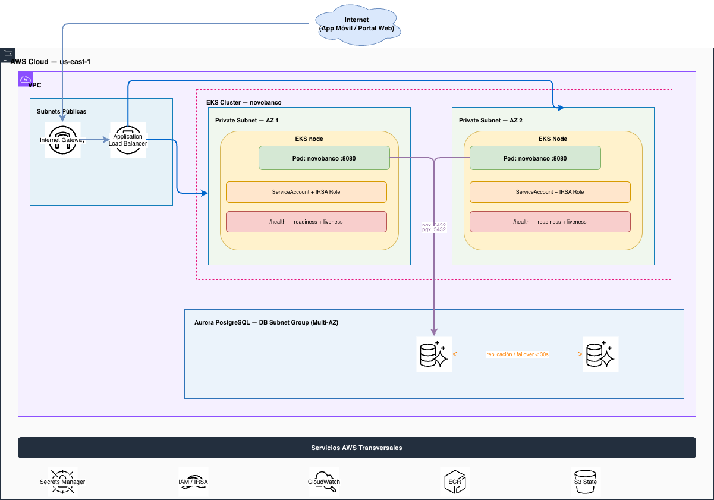
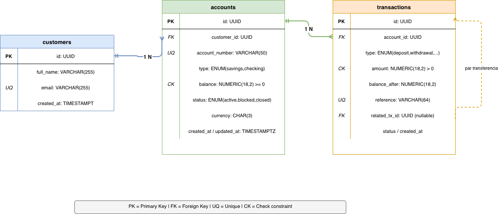

# NovoBanco — Microservicio de Cuentas y Transacciones

Microservicio REST para gestión de cuentas bancarias y transacciones financieras, construido en Go 1.22 y desplegado en AWS sobre EKS.

---

## Descripción del Problema

El área de Canales Digitales de NovoBanco requiere un microservicio que sea consumido por la
app móvil y el portal web del banco. El sistema debe gestionar el ciclo de vida completo de
cuentas bancarias y permitir operar sobre fondos (depósitos, retiros y transferencias),
garantizando consistencia, trazabilidad y correctitud en cada operación financiera.

---

## Stack Tecnológico

| Capa | Tecnología                  |
|---|-----------------------------|
| Lenguaje | Go 1.22                     |
| Framework HTTP | Chi v5                      |
| Base de Datos | Aurora PostgreSQL 15        |
| Driver BD | pgx/v5                      |
| Cómputo AWS | EKS                         |
| IaC | Terraform                   |
| Contenedor | Docker (multi-stage, ~15MB) |

---
## Arquitectura propuesta



---

## Ejecución Local

**Requisitos:** Docker y Docker Compose.

```bash
# Levantar la aplicación y PostgreSQL con un solo comando
docker compose up --build

# La API queda disponible en http://localhost:8080
```

## Endpoints de la API

La coleccion de POSTMAN con ejemplos de payloads y respuestas se encuentra en `docs/API_COLLECTION.json` — se puede importar directamente a Postman o usar como referencia para pruebas manuales.

Todos los endpoints (excepto `/health`) requieren el header:

```
X-API-Key: <API_KEY>

El api key de prueba es: fake-key-123
```

### Health

| Método | Ruta      | Descripción                        |
|--------|-----------|------------------------------------|
| GET    | `/health` | Liveness/readiness probe (sin auth)|

### Clientes

| Método | Ruta              | Descripción          |
|--------|-------------------|----------------------|
| POST   | `/customers`      | Crear cliente        |
| GET    | `/customers/{id}` | Obtener cliente      |

### Cuentas

| Método | Ruta                       | Descripción                         |
|--------|----------------------------|-------------------------------------|
| POST   | `/accounts`                | Crear cuenta (savings / checking)   |
| GET    | `/accounts/{id}`           | Obtener cuenta                      |
| PATCH  | `/accounts/{id}/status`    | Cambiar estado (blocked / closed)   |

### Transacciones

| Método | Ruta                              | Descripción                        |
|--------|-----------------------------------|------------------------------------|
| POST   | `/accounts/{id}/deposit`          | Depositar fondos                   |
| POST   | `/accounts/{id}/withdrawal`       | Retirar fondos                     |
| POST   | `/transfers`                      | Transferir entre cuentas           |
| GET    | `/accounts/{id}/transactions`     | Historial paginado                 |
| GET    | `/transactions/{reference}`       | Buscar por referencia única        |

### Códigos de Error

| Código HTTP | `code`                  | Causa                                    |
|-------------|-------------------------|------------------------------------------|
| 400         | `invalid_amount`        | Monto <= 0                               |
| 400         | `invalid_status`        | Transición de estado inválida            |
| 401         | `unauthorized`          | API Key ausente o incorrecta             |
| 404         | `account_not_found`     | Cuenta no existe                         |
| 404         | `customer_not_found`    | Cliente no existe                        |
| 409         | `duplicate_reference`   | Referencia ya registrada (idempotencia)  |
| 422         | `account_blocked`       | Cuenta bloqueada no puede operar         |
| 422         | `account_closed`        | Cuenta cerrada no puede operar           |
| 422         | `insufficient_funds`    | Saldo insuficiente para el retiro        |

---

## Esquema de Base de Datos

Motor: **Aurora PostgreSQL**



---

## Escenarios de Negocio

### Saldo negativo
Prevenido en **dos capas**:
1. La capa de repositorio ejecuta `UPDATE accounts SET balance = balance - $1 WHERE id = $2 AND balance >= $1` — si el saldo es insuficiente, no actualiza y retorna `ErrInsufficientFunds`
2. La tabla tiene `CONSTRAINT balance_non_negative CHECK (balance >= 0)` como segunda línea de defensa

### Cuenta inactiva
`account.IsOperable()` retorna `ErrAccountBlocked` (HTTP 422) o `ErrAccountClosed` (HTTP 422) con códigos de error específicos — nunca un error genérico.

### Transferencia parcial
Debit + credit + inserción del par de transacciones ocurren dentro de una **única transacción pgx**. El `defer dbTx.Rollback(ctx)` garantiza que si el contenedor muere en cualquier punto antes del COMMIT, PostgreSQL revierte todo al detectar la conexión cerrada. No existe estado parcial posible.

### Concurrencia básica
El UPDATE de saldo usa `WHERE balance >= amount` — operación atómica a nivel de fila en PostgreSQL. No existe ventana entre lectura y escritura (no hay TOCTOU). Solo uno de dos retiros concurrentes sobre la misma cuenta puede ganar.

### Idempotencia
Antes de ejecutar cualquier operación, el servicio busca la referencia en la tabla `transactions` (índice único en `reference`). Si ya existe, retorna la transacción existente con `duplicate: true` sin tocar el saldo — sin error al cliente. Esto previene el doble débito/crédito por reintentos de red.

### Gestión de Secretos
Las credenciales de base de datos nunca se queman en el Dockerfile ni en el código fuente. La separación es clara según el entorno:

- **Local:** `docker-compose.yml` inyecta `DATABASE_URL` como variable de entorno apuntando a un PostgreSQL estándar en Docker. Las credenciales (`novobanco:novobanco`) son de desarrollo y no representan un riesgo.
- **AWS (producción):** el pod asume un IAM Role via **IRSA** (OIDC) y llama a `secretsmanager:GetSecretValue` para obtener la `DATABASE_URL` de Aurora. Nunca aparecen credenciales en variables de entorno planas ni en ConfigMaps.

### Alta Disponibilidad
2 réplicas Kubernetes distribuidas entre AZs mediante `topologySpreadConstraints`. Aurora Multi-AZ con failover automático < 30s. Si cae una AZ completa, la otra sigue operando.

---

## ADR — Architecture Decision Records

### ADR-001: EKS sobre ECS Fargate / Lambda

**Contexto:** Se necesita un servicio de cómputo en AWS para ejecutar el microservicio contenerizado.

**Opciones consideradas:**
- AWS Lambda — serverless, sin gestión de infraestructura
- ECS Fargate — contenedores gestionados sin nodos
- EKS — Kubernetes gestionado

**Decisión:** EKS

**Consecuencias:**
- ✅ HPA (Horizontal Pod Autoscaler) para escala automática por CPU/memoria
- ✅ `topologySpreadConstraints` para distribución explícita entre AZs
- ✅ IRSA para acceso a Secrets Manager sin credenciales embebidas
- ✅ El mismo cluster puede alojar múltiples microservicios en el futuro
---

### ADR-002: Aurora PostgreSQL sobre DynamoDB / RDS PostgreSQL

**Contexto:** El dominio bancario requiere consistencia transaccional, integridad referencial y queries complejas sobre movimientos.

**Opciones consideradas:**
- DynamoDB — NoSQL, alta escala horizontal
- RDS PostgreSQL — relacional, single-AZ por defecto
- Aurora PostgreSQL — relacional, Multi-AZ nativo

**Decisión:** Aurora PostgreSQL 15

**Consecuencias:**
- ✅ Transacciones ACID garantizan atomicidad en transferencias
- ✅ Failover automático < 30s con Reader en AZ separada

---

### ADR-003: Go sobre Java / Node.js

**Contexto:** Se necesita elegir el lenguaje de implementación del microservicio. El sistema debe manejar operaciones financieras concurrentes, tener un footprint pequeño en contenedor y tiempos de arranque rápidos para escalar en EKS.

**Opciones consideradas:**
- Java (Spring Boot) — ecosistema maduro, amplio uso en banca
- Node.js (Express/Fastify) — liviano, I/O no bloqueante
- Go — compilado, tipado estático, concurrencia nativa

**Decisión:** Go 1.22

**Consecuencias:**
- ✅ Binario estático compilado — imagen Docker final de ~15 MB vs ~300 MB de una JVM
- ✅ Tiempo de arranque < 100ms — los pods de EKS están listos casi inmediatamente tras el deploy
- ✅ Goroutines para concurrencia nativa — manejo eficiente de múltiples requests sin bloqueo de threads
- ✅ Tipado estático con interfaces — los `ports` (interfaces de repositorio) garantizan contratos en tiempo de compilación, no en runtime
- ✅ `pgx` como driver de PostgreSQL — pool de conexiones nativo sin overhead de ORM
- ✅ Sin garbage collector stop-the-world significativo — latencias más predecibles que la JVM bajo carga

**Por qué no Java:** Spring Boot en contenedor requiere JVM (~200 MB), tiempo de arranque de 3-8 segundos y mayor consumo de memoria en reposo. Para un microservicio de este tamaño, ese overhead no está justificado.

---

### ADR-004: Arquitectura Hexagonal (Ports & Adapters) sobre MVC o arquitectura en capas

**Contexto:** Se necesita definir cómo organizar el código del microservicio para que la lógica de negocio sea independiente de la infraestructura (base de datos, HTTP, AWS).

**Opciones consideradas:**
- MVC (Model-View-Controller) — patrón clásico, simple, acoplado a la capa de transporte
- Arquitectura en capas (Layered) — controller → service → repository, dependencias directas entre capas
- Hexagonal (Ports & Adapters) — el dominio no conoce nada del exterior; los adapters implementan interfaces definidas por el dominio

**Decisión:** Arquitectura Hexagonal

**Flujo de dependencias:**
```
handler (HTTP) → service → ports (interfaces)
                               ↑
                        repository (pgx)   ← implementa los ports
```

El `service` nunca importa `handler` ni `repository` — solo conoce los `ports`. Esto es la inversión de dependencias de la arquitectura hexagonal.

**Consecuencias:**
- ✅ Los tests unitarios de `service` usan mocks que implementan los `ports` — sin base de datos real
- ✅ Se podría reemplazar PostgreSQL por DynamoDB o cualquier otro motor cambiando solo `repository/` — el dominio y los servicios no cambian
- ✅ Se podría exponer la misma lógica por gRPC o mensajería (Kafka) agregando un nuevo adaptador de entrada sin tocar `service/`
- ⚠️ MVC hubiera sido suficiente para este tamaño, pero la arquitectura hexagonal facilita el crecimiento y el testing


---
## Pruebas

```bash
# Correr unit tests del paquete service
make validate

# Ver reporte de cobertura en el browser
make coverage
```

Los tests cubren la capa de servicio con mocks escritos a mano implementando los ports. No requieren base de datos.

Casos cubiertos:
- Crear cuenta: cliente existe, cliente no encontrado, error de repositorio
- Transacciones: depósito/retiro OK, cuenta bloqueada, cuenta cerrada, fondos insuficientes, referencia duplicada
- Transferencia: OK, monto inválido, cuenta origen bloqueada, cuenta destino cerrada, fondos insuficientes, duplicado

---

## Supuestos Asumidos

1. **Moneda única:** Todas las cuentas operan en USD. No se implementa conversión de divisas.
2. **Un tipo de cuenta por creación:** No se valida que un cliente tenga máximo una cuenta de cada tipo — puede tener múltiples savings o checking.
3. **Autenticación simple:** Se usa API Key (`X-API-Key`) como mecanismo de autenticación. En producción real se usaría OAuth2 / JWT o un middleware especializado en buscar credenciales de DynamoDB.
4. **Migrations manuales:** Las migraciones SQL se ejecutan al iniciar el contenedor `db` via `docker-compose.yml`.
